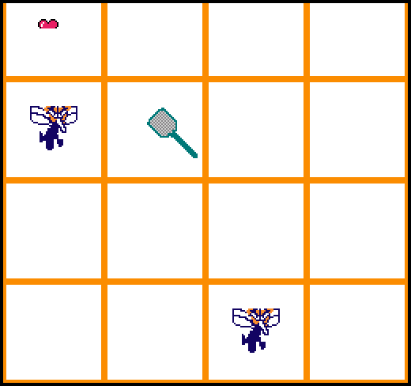

# Whack-a-mosquito

Author: Wenlin Mao, Zi Wang, Martin Ke

Design: Mosquitos are annoying, we neet to kill them. This game simulates the mosquito elimation process
and guard our summer happiness. We use the flyswatter to kill mosquito and survive from a lot of mosquitos.

Screen Shot:

How Your Asset Pipeline Works:\
The whole pipeline works like this.\
We create a new PNGSprite class, it contains a vector of colors, an array of sprites and other member variables.\
First, we load a png using PNGLoader to load files into a vector of colors.\
Then, we divide this vector into n tiles (8x8) and store them into the tile table in PPU.\
After this, we create n sprites and store them together in the sprite array.\
When we want to use this png in our game, we copy the array into PPU's sprites to make it show up.

Sound pipeline are mainly created by SDL2 library. We used SDL2's loadWav function to load the sound effects.
Then, we use SDL2's APIs to recognize the device and push the sound clip to the queue when the hit or miss effect is trigered.
All sound clips are preprocessed with iMoive to fit the time stamp.

How To Play:

(TODO: describe the controls and (if needed) goals/strategy.)

Sources:

* The pipeline ideas of using multiple tiles to form a png picture and structure is inspired Oscar
* The hit and miss sound effects are all from https://freesound.org/.
* All pixel art assets are created by https://www.pixilart.com/draw. 
* blood is inspired by http://pixelartmaker.com/art/a3c176205942be4
* mosquito is inspired by https://www.google.com/url?sa=i&url=https%3A%2F%2Fwww.pngwing.com%2Fen%2Ffree-png-hfxck&psig=AOvVaw13IpFw5JjXX2UF5az_gxER&ust=1631672284637000&source=images&cd=vfe&ved=0CAwQjhxqFwoTCLj13Yqz_fICFQAAAAAdAAAAABAD
* flyswatter is inspired by https://dandydungeon.fandom.com/wiki/Fly_Swatter
* heart is inspired by https://www.vectorstock.com/royalty-free-vector/pixel-art-heart-love-color-icon-valentine-vector-15134146
* G character is inspired by http://pixelartmaker.com/art/de49826ec5e9dff

This game was built with [NEST](NEST.md).

